# Different Types of Learning

## Supervised Learning

* can comprise of input (x) and the corresponding output (y).
* Given an observation x, what is the best label(output) for y

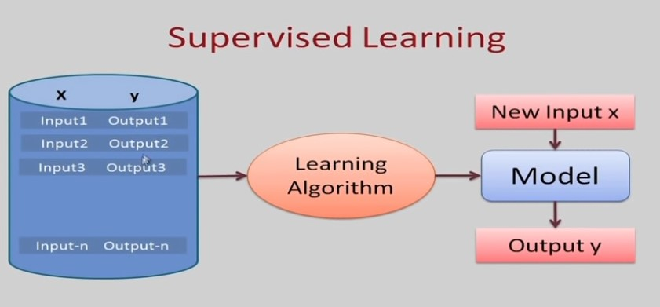

1. Given:
    - A set of input features X~1~, X~2~, X~3~, ..., X~n~.
    - A target feature Y.
    - A set of training examples where the values for the input features and target features are given for each example.
    - A new example, where only the values for the input features are given.
2. Predict the values for the target features for the new example.
    - classification when Y is discrete (ex. whether it will rain or not tomorrow).
    - regression when Y is continuous (ex. predict price of the house).

For training

| Instance (I) | X~1~, X~2~, ..., X~n~  | Y     |
| :----------: | :--------------------: | :--:  |
| I~1~         | a~1~, a~2~, ..., a~n~  | y~1~  |
| I~2~         | b~1~, b~2~, ..., b~n~  | y~2~  |
| I~3~         | c~1~, c~2~, ..., c~n~  | y~3~  |
| I..          | .~1~, .~2~, ..., .~n~  | y~.~  |
| Test         | z~1~, z~2~, ..., z~n~  | y~n~  |

### Classification Example:

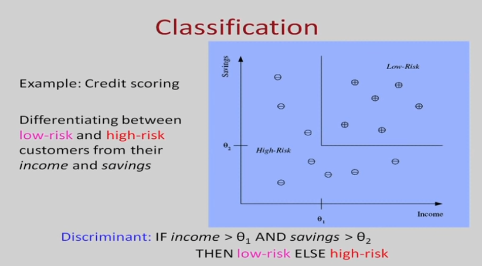

#### Classification Learning

* we have a Task T: which as
    - input: a set of instances d~1~, d~2~, ..., d~n~
        * an instance has a set of features
        * we can represent an instance as a vector d=x~1~, x~2~, ..., x~n~
    - output: a set of predictions for the inputs y~1~, y~2~, ..., y~n~
        * one of a fixed set of constant values:
            - {+1, -1} or {cancer, healthy}, or {rose, hibiscus, jasmine, ...}, or ...
* Performancee metric P: 
    -  probability of wrong prediction or it can be the performance metric can be accuracy or the probability of wrong prediction of the error
* Experience E: a set of labeled examples where y are the true labels for x for those training examples have the ground truth data. These examples come from some fixed distribution.

sample classification tasks

Finding company names in text
    Given a particular word and want to find out is it the name of the company. This is the entity recoginition task, So instance is the word and the context of the word. which words come before the wordm which words come after the word and may be certain features of the word.
    Ex: is the word capitalized, is the word following this word i and c, is the bigram or two words previous this word context acquired by and so on and the output labels are firstm later, outside. If it is the company name is it the first word in that name is it inside a company name, is it outside company name.

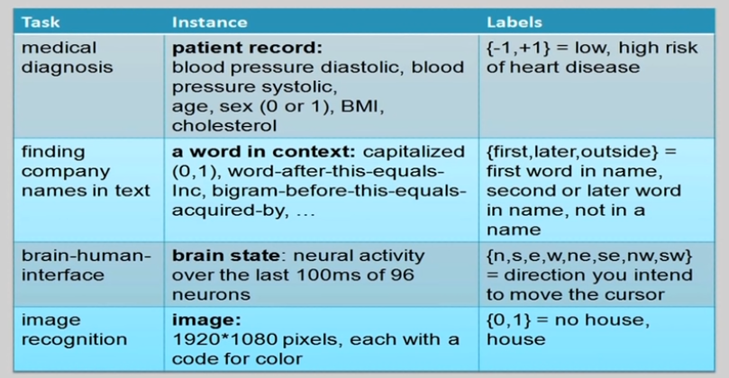

#### Representations

Representation of the function there are two things: features and function class

Function can be

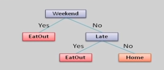{ align=right }
1. `Decision Tree`

:   Not Yet Started Not Yet Started Not Yet Started Not Yet Started Not Yet Started Not Yet Started Not Yet Started Not Yet Started Not Yet Started Not Yet Started Not Yet Started Not Yet Started Not Yet Started Not Yet Started Not Yet Started Not Yet Started Not Yet Started Not Yet Started Not Yet Started Not Yet Started Not Yet Started Not Yet Started

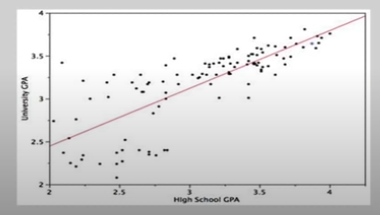{ align=right }
2. `Linear function: in terms of attributes`
:   Not Yet Started Not Yet Started Not Yet Started Not Yet Started Not Yet Started Not Yet Started Not Yet Started Not Yet Started Not Yet Started Not Yet Started Not Yet Started Not Yet Started Not Yet Started Not Yet Started Not Yet Started Not Yet Started Not Yet Started Not Yet Started Not Yet Started Not Yet Started Not Yet Started Not Yet Started

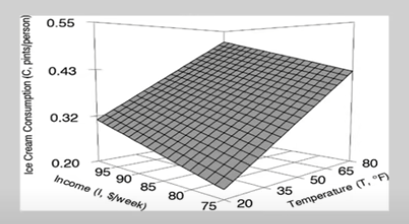{ align=right }
3. `Multivariate linear function`
:   Not Yet Started Not Yet Started Not Yet Started Not Yet Started Not Yet Started Not Yet Started Not Yet Started Not Yet Started Not Yet Started Not Yet Started Not Yet Started Not Yet Started Not Yet Started Not Yet Started Not Yet Started Not Yet Started Not Yet Started Not Yet Started

{ align=right }
4. `Single layer perceptron`
:   Not Yet Started Not Yet Started Not Yet Started Not Yet Started Not Yet Started Not Yet Started Not Yet Started Not Yet Started Not Yet Started Not Yet Started Not Yet Started Not Yet Started Not Yet Started Not Yet Started Not Yet Started Not Yet Started Not Yet Started Not Yet Started Not Yet Started Not Yet Started Not Yet Started Not Yet Started Not Yet Started Not Yet Started

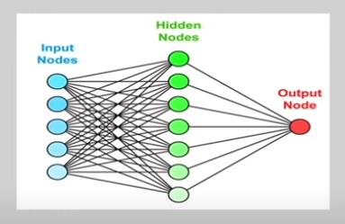{ align=right }
5. `Multi-layer neural network`
:   Not Yet Started Not Yet Started Not Yet Started Not Yet Started Not Yet Started Not Yet Started Not Yet Started Not Yet Started Not Yet Started Not Yet Started Not Yet Started Not Yet Started Not Yet Started Not Yet Started Not Yet Started Not Yet Started Not Yet Started Not Yet Started Not Yet Started Not Yet Started Not Yet Started Not Yet Started Not Yet Started Not Yet Started

#### Hypothesis Space

Hypothesis space is **the set of all the possible legal hypothesis**. This is the set from which the machine learning algorithm would determine the best possible (only one) which would best describe the target function or the outputs. Best Solution = Hypothesis.

#### Terminology

- Features: The number of features or distinct traits that can be used to describe each item in an quantitative manner.
- Feature Vector: n-dimensional vector of numerical features that represent some object.
- Instance Space X: set of all possible objects describable by features.
- Example (x, y): Instance x with label y=f(x).
- Concept c: Subset of objects from X (c is unknown).
- Target Function f: Maps each instance x ∈ X to target label y ∈ Y.
- Example (x, y): Instance x with label y=f(x).
- Training Data S: Collection of examples observed by learning algorithm

### Regression Example:

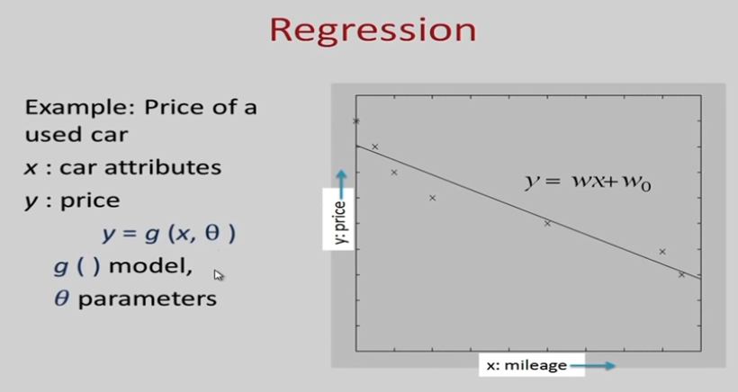

#### Features (Regression):

Often, the individual observations are analyzed into a set of quantifiable properties which are called features. May be

* categorical (e.g. "A", "B", "AB" or "O", for blood type)
* ordinal (e.g. "large", "medium", or "small)
* integer-valued (e.g. the number of words in a text)
* real-valued (e.g. height)

#### Example Data

Which shows sample training examples we have five features (Action, Author, Thread, Length, Where) and different rows are different instances (e~1~, e~2~, e~3~, ...). show below table

Training Examples:

|      | Action | Author  | Thread | Length | Where |
| :--: | :----: | :-----: | :----: | :----: | :---: |
| e~1~ | skips  | known   | new    | long   | home  |
| e~2~ | reads  | unknown | new    | short  | work  |
| e~3~ | skips  | unknown | old    | long   | work  |
| e~4~ | skips  | known   | old    | long   | home  |
| e~5~ | reads  | known   | new    | short  | home  |
| e~6~ | skips  | known   | old    | long   | work  |

based on the training example comprising of this labeled instances you learned a model so that for a new instance you can predict the output features.

New Examples:

|      | Action | Author  | Thread | Length | Where |
| :--: | :----: | :-----: | :----: | :----: | :---: |
| e~7~ | ???    | known   | new    | short  | work  |
| e~8~ | ???    | unknown | new    | short  | work  |

#### Schematic Diagram

in supervised learning you have the training set, the learning algorithm uses the training set to come up with a model or hypothesis, and in the testing phase given a new instance you use the hypothesis to predict the value of Y.

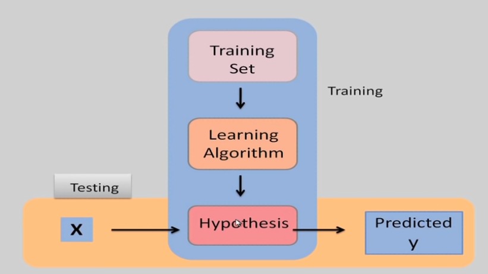

This also be shown like this in the training phase you get the input and label. From the input you can extract the feature of the input and feed it to the machine learning algorithm. Similarly in the testing phase given the input use a feature extractor to extract the feature and you feed it to the classifier model to get the label.

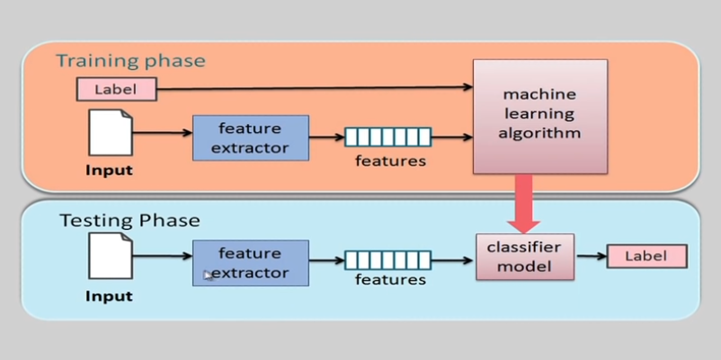

## Unsupervised Learning

* only given x, there is no label to the data.
* given a set of x's, cluster or summarize them or find some patterns.

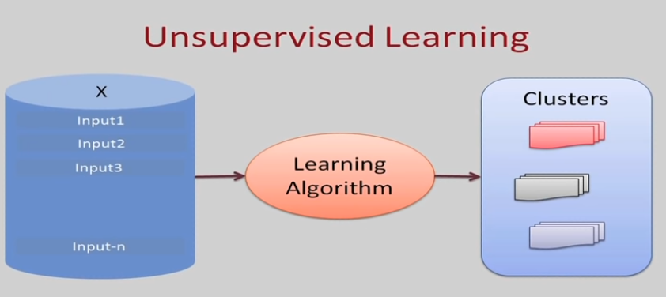

## Reinforcement Learning
Agent who is acting in an environment, and you want to figure out what actions  the agent must take at every step. The action that the agent takes is based on the rewards or penality is that the agent gets in different states.

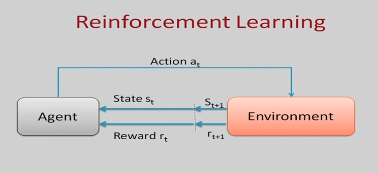
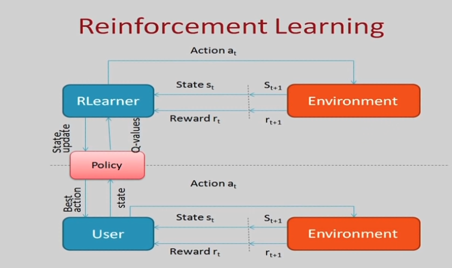

## Semi-supervised Learning

* It is the combination of supervised and unsupervised learning. That is you have some labeled training data and also have larger amount of unlabeled training data and can try to come up with some learning algorithm that convert even when the training data is limited.

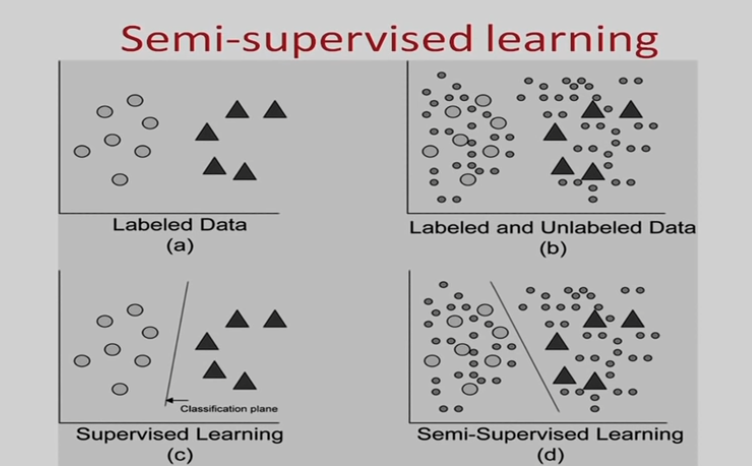

*[discrete]: Indiviually separate.
