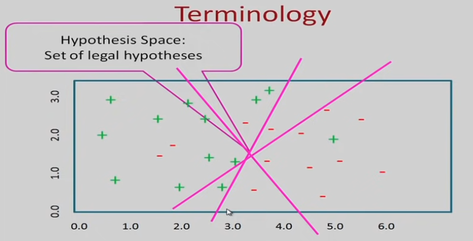

# Hypothesis Space and Inductive Bias

In inductive learning or prediction, we have given a examples of data, the example are of the form (x, y). where x for a particular instance x comprises of the values of the different feature of that instance and y is the output attribute also can be given (x, f(x))

the output of an instance is a function of the input feature vector, and this is the function that we are trying to learn, we are given x, f(x) pairs

For a classification problem this function f(x) is discrete
In Regression the function f(x) is continuous.
In some cases we want to find out the probability of a particular value of y, for those problems, where we look at probability estimation, out f(x) is the probability of x.

`Inductive Learning`

:   Given some data and trying to do induction to try to identify a function, which can explain the data. So, induction as oppose to deduction, unless we can see all the instances all the possible data points or we make some restrictive assumption about the language in which the hypothesis is expressed or some bias, this problem is not well defined so that why it called as inductive problem.

## Types of Inductive learning

- Classification   f(x) is discrete.
- Regression f(x) is continuous.
- Probability estimation f(x) is the probability of x.

Have to learn a function, it is a function of the features, so instances are described in terms of features.
So, features are properties that describe each instance and each instance can be described in a quantitative manner using features. Often we have multiple features so we have what we call a feature vector.

Feature Vector

for particular instance we may be or a particular task we may be describing all the instances in terms of ten features, so the feature vector will be a one-dimensional vector of size 10.
Now based on this can define a features space, for simplicity assume that there are two features are x~1~ and x~2~.
In general can have n number of features, we have two features the features define a two-dimensional space if we have n features the define an n dimensional space if you take a particular instance.

So, in order to answer the prediction problem we have to come up with the function, let us say we come up with the pink function pink line, and we say lines points that lie to the right of the pink line is negative the points which lie to the left of the pink line is positive.

So, this pink line is the function that we have come up with and so this is the hypothesis or function that we use to do our prediction.

Now, we could have instead of this particular line have hypothesized other functions. So, all these are possible functions which we could have found and the set of all such legal functions that we could have come up with they define the hypothesis space. In a particular learning problem, you first defined the hypothesis the space that is the class of function that you are going to consider then given the data points, you try to come up with the best hypothesis given the data that you have.

## Representations

Function is represented in terms of features.
There are twi things that we need in order to describe a function, have to decide the features of the vocabulary and have to decide the function class or the type of function or the language of the function that will have to be using.

So, based on features and the language can define our hypothesis space. Various types of representations have been considered for making predictions.
Ex: A linear function to act as a discriminator between two classed, will in a subsequent class, look at a representation by using a structure called a decision tree. At every node, we take a decision based on the value of an attribute. Based on that, we go to different branches so at every node we make a decision based on the value of an attribute and every leaf node is labeled by the value of y.
So, decision tree is a type of representation.
Linear function is one type of representation.
Can also have multivariate linear function can have neural networks.

## Hypothesis Space

Once chosen the features and the language or the class of function, what you have is a hypothesis space.

So hypothesis space is a set of all legal hypothesis that you can describe using the features that you have chosen, and the language that you have chosen. This is the set from which the learning algorithm will pick a hypothesis.

So, hypothesis space is represent as H and the learning algorithm outputs a hypothesis h belonging to H (h ∈ H), this is the output of a learning algorithm. So, H denotes all legal hypothesis all possible outputs by the learning algorithm. Given the training set given the particular data points, the learning algorithm will come up with one of the hypothesis space which hypothesis it comes up with will depend on the data and it also will depend on what type of restrictions or biases that have imposed.

- Example (x, y): Instance x with label y=f(x).
- Training Data S; Collection of examples observed by learning algorithm.
- Instance Space X: Set of all possible objects describable by features.
- Concept c: Subset of objects from X (c is unknown).
- Target Function f: Maps each instance x ∈ X to target label y ∈ Y (f: x -> y)

## Classifier

- Hypothesis h: Function that approximates f.
- Hypothesis Space H: Set of functions we allow for approximating f.
- The set of hypothesis that can be produced, can be restricted further by specifying a language bias. Bias can specify some constraints on the language or some preferences. Bias of two types, it can be in terms of constraints or the bias can be in terms of preferences.
- Input: Training set S ⊆ X.
- Output: A hypothesis h ∈ H.
