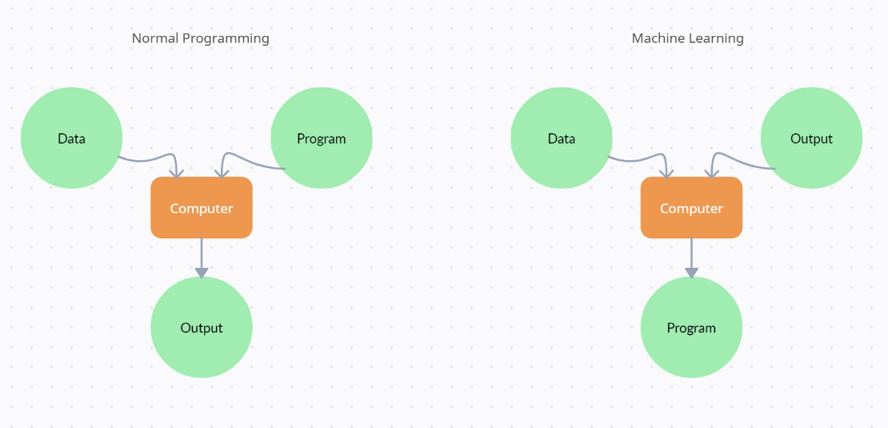
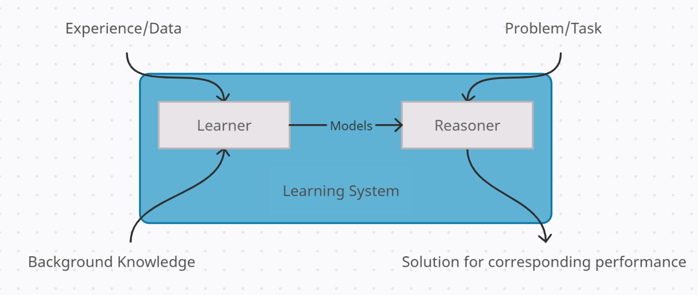

## Introduction
<!-- # not understanded starts -->
Perceptron: Simple neural network unit, building blocks of Machine Learning

Neural network specific back propagation was develop back propagation is the key of today neural network architecture
<!-- # not understanded ends -->

## Algorithm to solve the problem

## Fundamental Laws

Machine Learning explores algorithm that
- learn from data and build modules from data.
- module can be used for prediction, decision making or solving tasks.

## Definition

- A computer program is said to learn from experience E (data)
- with respect to some class of tasks T (prediction, classification, acting env etc.)
- and performance measure P
- if its performance on tasks in T as measure by P
- improves with experience E

## Schematic Diagram

## Examples

Medicine:

- Diagnose a disease
    - Input: symptoms, lab measurements, test results, DNA test etc...
    - Output: one of set of possible diseases, or none of the above.
- Data mine historical medical records and learn which future patients will respond best to which treatments.

Vision:

- where given an image want to find out what object appear and where the objects appear in an image.

Robot Control:

- To design autonomous mobile robots that learn to navigate from their own experience.

Natural Language Processing:

- can detect where entities are mentioned in natural language.
- detect what facts are expressed in natural language.
- detect if a product/movie review is positive, negative or neutral.

Speech Recognition:
Machine Translation:

Financial:

- predict if a stock will rise or fall.
- predict if a user will click on an adv or not.

## Application in Business Intelligence

- Robustly forecasting product sales quantities taking seasonality and trend into account.
- Identifying cross selling promtional opportunities for consumer goods.
- Identify the price sensitivity of a consumer product and identify the optimum price point that maximizes net profit.
- Optimizing product location at a super market retail outlet.
- Modeling variables impacting customers churn and refining strategy.

## Steps

1. Choose the training experience (data).
2. Choose the target function or how to represent model (target function to be learned).
3. Choose how to represent the target function.
4. Choose a learning algorithm to to infer the target function.

*[Learning]: The ability to improve behaviour based on experience.