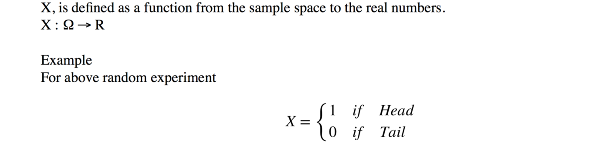
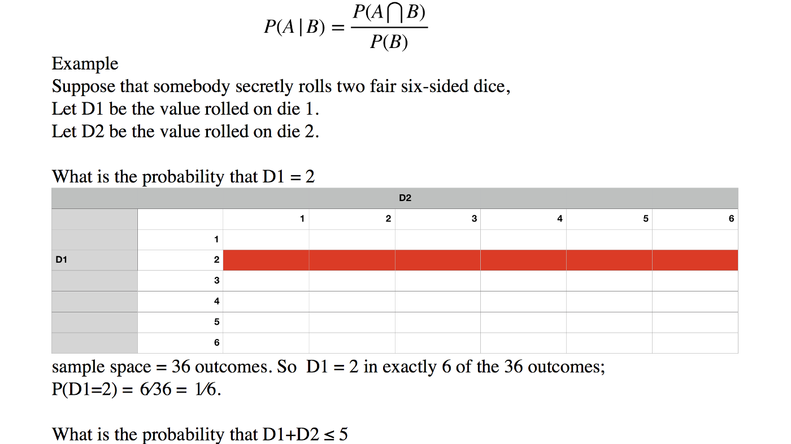
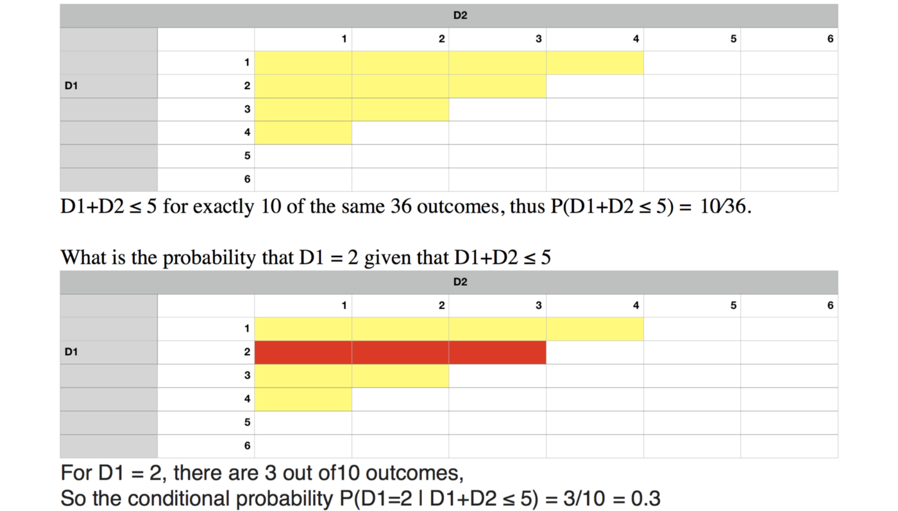
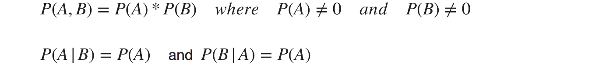
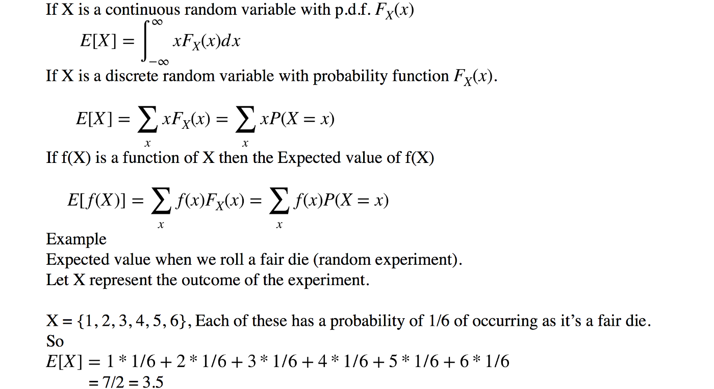

## Random Experiment

* Outcome cannot be predicted until it observed.

Ex: Toss a coin once.

## Sample Space

* Set of all possible outcomes of a random experiment.

Ex: Head, Tail

## Random Variables

* Values are numerical outcomes of a random experiment.

Two Types:

1. **Discrete Random Variable** take on only a countable number of distinct (noticeable difference) values such as 0, 1, 2, 3, 4....... Discrete random variables are usually (but not necessarily) counts.

2. **Continuous Random Variable** takes an continuous random variables are usually measurements.

{ align=left }

## Probability

It is the measure will occue in a random experiment. It is quantified as a number betwween 0 and 1, 0 indicates impossibility and 1 indicates certainty (confidence)

Ex: Coin has two outcomes (heads and tails) both equally probable, probability of heads equals to probability of tails, probability of either heads or tails is 1/2 (also be written as 0.5 or 50%).

## Conditional Probability

It is the measure of probability of an event given by (assumption, presumption, assertion).

Ex: If the event of interest is A and the event B is known or assumed to have occured, conditional probability of A given B is written as P(A | B).

{ align=left }
{ align=left }

## Independence

If we have observation about one event it doesn't affect the probability of the other. For Independent events A and B below is true.

{ align=left }

Ex: Rolled a die and flipped a coin. The probability of getting any number face on the die is no way influences the probability of getting a head or a tail on the coin.

## Conditional Independence

{ align=left }

## Expectation

Expectation of a random variable X is written as E(X). If we observe N random values of X, then the mean of the N values will be approximately equal to E(X) for large N. Expectation is what you would expect the outcome of an experiment to be on an average if you the repeat the experiment a large number of time.

{ align=left }

*[assumption]: certain to happen without proof
*[presumption]: an idea that is taken to be true on the basis of probability
*[assertion]: confident